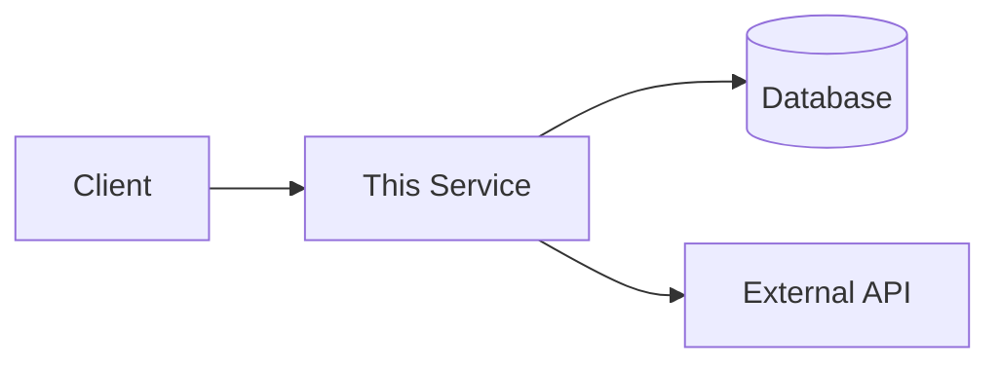

Analyze the project and create/update README.md following the sipgate README template.

## Project Analysis

1. **Analyze the project thoroughly** using subagents in parallel:
   - Source code structure and architecture
   - Build files (pom.xml, package.json, Dockerfile, etc.)
   - GitHub Actions workflows
   - Configuration files
   - External integrations (databases, queues, APIs)

2. **Ignore AGENTS.md and CLAUDE.md as README source material** — agent instructions might be outdated or irrelevant for user-facing documentation

## sipgate README Template

Write the README in German following this exact structure:

```markdown
<small>Diese README basiert auf dem [README-Template](https://tech.docs.sipgate.cloud/regeln/readme-template/).</small>

# [Project Name]

[](https://github.com/orgs/sipgate/teams/[TEAM])

[](https://github.com/sipgate/[REPO]/actions/workflows/build-docker-image.yaml)
[](https://github.com/sipgate/[REPO]/actions/workflows/deploy.yaml)

[Target audience for this README]

[Description understandable for people unfamiliar with the domain]

- Gehört es zu was Größerem?
- Was macht das Ding?
- Mit welchen anderen Systemen interagiert das Ding und welche mit ihm?
- Diagram oder grafische Darstellung
- Verwendete Technologien

## Runbook

- Wie sehe ich, ob das System gestartet ist?
- Wie starte ich es?
- Auswirkungen bei Downtime
- Wie stoppe ich es?
- Wie starte ich es neu?
- Wie erkenne ich, dass es dem System gut geht?
  - Wie kann ich die Log-Files einsehen?
  - Dashboards (Grafana, Kibana etc.)
- Namen der Monitoring/Alerting-Checks und was sie checken
- Bekannte Probleme und ihre Lösungen

## Continuous Integration (CI) / Continuous Deployment (CD)

- Wo wird es deployt? Wo kann ich das Ergebnis sehen?
- Wie wird es deployt? Docker, Cloud, Ansible, GitHub Actions etc.
- Wie kann ich es ausrollen?
- Wann darf ich es ausrollen?
- Manuelle Schritte vor und nach dem Deployment?
  - Muss ich auf Monitoring/Alerting achten?
- Gibt es negative Auswirkungen?

## Entwicklung

- Wie starte ich es lokal?
  - Ökosystem
    - Technologien
    - Programmiersprachen
    - Betriebssystem-Spezialitäten
  - git Hooks
  - Kommandozeile/IDE Run Configurations
- Wie kann ich Tests ausführen?
- Besondere Coding Guidelines
- Architekturübersicht
```

## Diagrams

Evaluate where diagrams improve understanding and add Mermaid diagrams. Consider:

- **System context** — how this service fits into the larger system, external dependencies
- **Request/event flow** — how requests or events flow through the service
- **Architecture overview** — key components and their relationships

Example:


## Documentation Principles

- **Write in German** as per sipgate convention
- **Use Mermaid diagrams** where they clarify architecture, flow, or integrations
- **Project analysis is the source of truth** — prefer freshly gathered info over existing README
- **Preserve unique content** — keep information from existing README that isn't found elsewhere
- **Answer the questions** in each section rather than using them as headings
- **Skip sections** where information is genuinely not available (don't add placeholder text)
- **Deduplicate aggressively** — remove redundant statements, consolidate overlapping content
- **Keep descriptions understandable** for people outside the immediate domain

## Workflow

1. **Analyze the project** — gather all information from source code, configs, and build files
2. **Draft README** — write content based purely on project analysis, following the template structure
3. **Merge existing README** — read the existing README.md (if present) and add any information that wasn't captured in step 2
4. **Fill template gaps** — add any remaining template sections where information is now available
5. **Deduplicate** — remove redundant information, consolidate similar sections
6. **Finalize** — replace [TEAM] and [REPO] placeholders, verify badge URLs match actual workflow files. If the team name wasn't present before, ask me for it.

## Output

After updating README.md, report:

```markdown
# README Documentation Report

## Sections Updated
- [List of sections written/updated]

## Sections Skipped
- [Sections with no available information, and why]

## Recommendations
- [Missing information that would improve the README]
```
